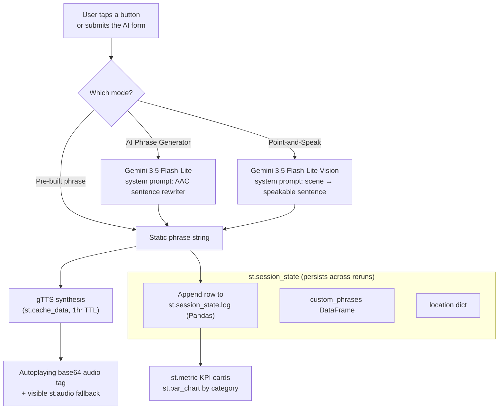

```
 █████╗ ██╗   ██╗██████╗ ██╗ ██████╗       █████╗  ██████╗ ██████╗
██╔══██╗██║   ██║██╔══██╗██║██╔═══██╗     ██╔══██╗██╔════╝██╔════╝
███████║██║   ██║██║  ██║██║██║   ██║     ███████║██║     ██║
██╔══██║██║   ██║██║  ██║██║██║   ██║     ██╔══██║██║     ██║
██║  ██║╚██████╔╝██████╔╝██║╚██████╔╝     ██║  ██║╚██████╗╚██████╗
╚═╝  ╚═╝ ╚═════╝ ╚═════╝ ╚═╝ ╚═════╝      ╚═╝  ╚═╝ ╚═════╝ ╚═════╝

  Audio-Accessibility Communicator
  AAC dashboard for people with temporary vocal loss
 
```


> **Live demo:** `https://audio-accessibility-communicator-aac.streamlit.app/ `
>
> **Author:** Caleb John Daniel Balakumar 

---

## About

Whether someone is mute or recovering from throat surgery, a bad case of laryngitis, or intubation, their ability to speak may be compromised — but their need to communicate doesn't pause. This app puts massive, one-tap buttons in front of them: tap "Chest pain" or "I need water" and the phrase is spoken aloud instantly. When a pre-built phrase isn't enough, Gemini turns a rough typed idea into a clean sentence, or reads a scene the user points the camera at, so they can "point-and-speak" instead.

---

## Features

| Feature | Rubric category it targets |
|---|---|
| 🚨 Emergency + 💬 Daily one-tap phrase grids | Core UX |
| 🤖 AI Phrase Generator (Gemini text, `st.form`-gated) | AI Integration & Prompt Engineering |
| 📷 Point-and-Speak Vision Assistant (`st.camera_input` + Gemini Vision) | AI Integration — multimodality |
| ⭐ Editable custom phrase bank (`st.data_editor`) | UI/UX & Data Visualization |
| 📊 KPI cards (`st.metric`) + communication log + `st.bar_chart` | UI/UX & Data Visualization |
| 📍 Location sharing (`st.map`) | UI/UX & Data Visualization |
| `st.session_state` everywhere — nothing resets on rerun | Technical Implementation |
| Cached, autoplaying gTTS speech on every tap | Technical Implementation |

---

## Architecture

**Data flow, in one sentence:** a button tap or form submit → (optional
Gemini call for text/vision reasoning) → phrase string → gTTS synthesis
(cached) → autoplaying `<audio>` tag → logged to an in-memory Pandas
DataFrame that feeds the KPI cards and chart.



**Modules:**

- `app.py` — Streamlit dashboard: layout, session state, button grids, log/KPI rendering.
- `ai_utils.py` — Gemini client. Two purpose-built system prompts (not a generic chatbot):
  one rewrites rough ideas into speakable sentences, the other narrates camera frames.
  Fails soft to an offline fallback string if no API key is configured.
- `tts_utils.py` — gTTS synthesis wrapped in `st.cache_data` (repeated phrases like "Yes"
  aren't re-synthesized), plus a base64 `<audio autoplay>` injector so speech starts
  the instant a button is tapped.

---

## Setup

```bash
git clone <this-repo-url>
cd audio-accessibility-communicator
python -m venv venv && source venv/bin/activate      # Windows: venv\Scripts\activate
pip install -r requirements.txt

# Add your Gemini key (get one at https://aistudio.google.com/apikey)
cp .streamlit/secrets.toml.example .streamlit/secrets.toml
# then edit .streamlit/secrets.toml and paste your key in

streamlit run app.py
```

The app runs fine **without** a Gemini key too — the AI Phrase Generator
and Vision Assistant just fall back to an "offline mode" message instead
of crashing, so core one-tap communication always works.

---
